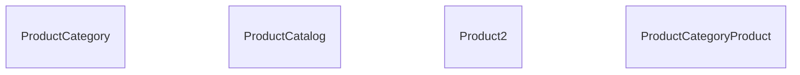
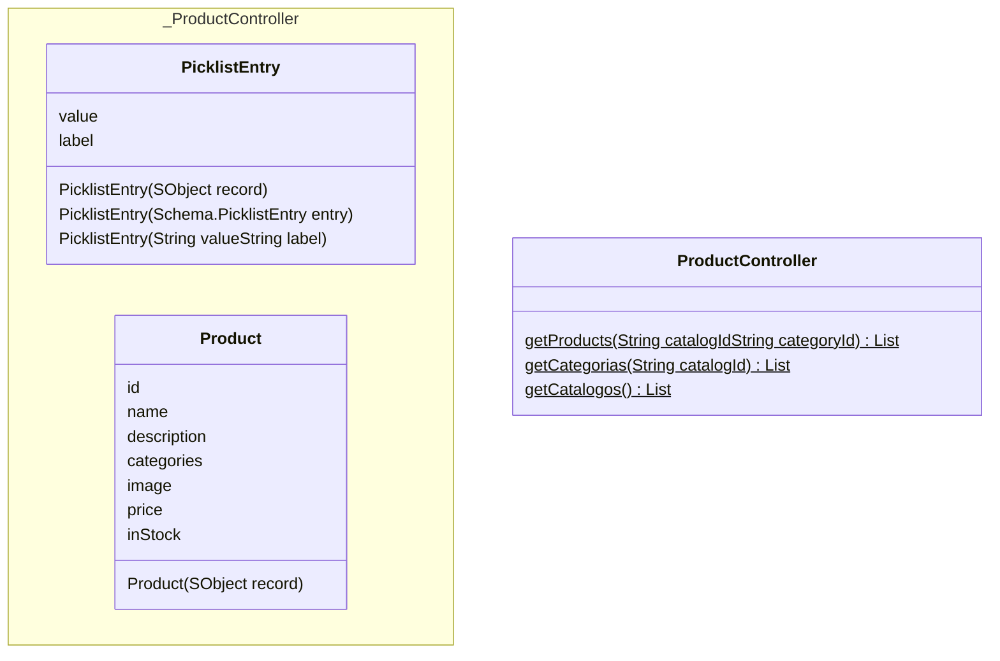

## Introducción

Antes de querer realizar cualquier venta tenemos que pasar por el modulo de configuracion.
Tiene como objetivo que un administrador, en nuestro caso lo representamos con el permission set "AdminCatalogo", cargue toda la información que se necesita para poder entrar en nuestro carrito, y asi poder generar una venta a un cliente nuestro.

CPQ son las siglas de Configure Price Quoting, en Salesforce hay dos productos, uno inicialmente era Steelbrick un ISV Partner del Appexchange, y otro Industries CPQ.

### Salesforce CPQ
No es especifico de una industria.

[Apex hours de Salesforce CPQ](https://www.apexhours.com/salesforce-cpq-training/)

### Industries CPQ
Esta orientado a industrias, nosotros lo tenemos como parte de Communication.
[Apex hours de Industries CPQ](https://www.youtube.com/watch?v=IoQoDWJ59Jg&t=195s)

### Funcionalidad

<!-- START autogenerated-objects -->

## Objetos

### Transaccionales

| #   | Label | Api Name | Descripcion |
| --- | ----- | -------- | ----------- |
| 

 | [Categoría](/diccionarios/objects/ProductCategory) | ProductCategory ||
| 

 | [Catálogo](/diccionarios/objects/ProductCatalog) | ProductCatalog ||
| 

 | [Producto](/diccionarios/objects/Product2) | Product2 ||
| 

 | [Producto de categoría de producto](/diccionarios/objects/ProductCategoryProduct) | ProductCategoryProduct ||

### Configuracion

| #   | Label | Api Name | Descripcion |
| --- | ----- | -------- | ----------- |

| #                                                              | Referencia    |
| -------------------------------------------------------------- | ------------- |
| 

 | Track History |

<!-- END autogenerated-objects -->
<!-- START autogenerated-classes -->

## Classes

### Diagrama

### Listado

| #   | Name | Api Version | Descripcion |
| --- | ----- | ----------- | ----------- |
| 

 | [PicklistEntry](./diccionarios/classes/PicklistEntry) |||
| 

 | [Product](./diccionarios/classes/Product) |||
| 

 | [ProductController](./diccionarios/classes/ProductController) |59||

| #  | Referencia       | #  | Referencia |
| -- | ---------------- | -- | ---------- |
| +  | public or global | #  | protected  |
| -  | private          | ~  | Package    |
| $  | final or static  | *  | abstract   |

<!-- END autogenerated-classes -->