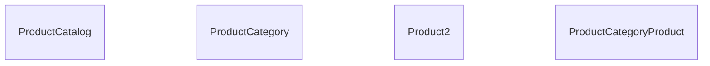
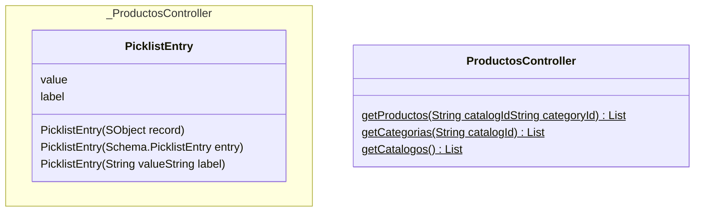

## Introducción

<!-- START autogenerated-objects -->

## Objetos

### Transaccionales

| #   | Label | Api Name | Descripcion |
| --- | ----- | -------- | ----------- |
| 

 | [Catalog](/diccionarios/objects/ProductCatalog) | ProductCatalog ||
| 

 | [Category](/diccionarios/objects/ProductCategory) | ProductCategory ||
| 

 | [Product](/diccionarios/objects/Product2) | Product2 ||
| 

 | [Product Category Product](/diccionarios/objects/ProductCategoryProduct) | ProductCategoryProduct ||

### Configuracion

| #   | Label | Api Name | Descripcion |
| --- | ----- | -------- | ----------- |

| #                                                              | Referencia    |
| -------------------------------------------------------------- | ------------- |
| 

 | Track History |

<!-- END autogenerated-objects -->
<!-- START autogenerated-classes -->

## Classes

### Diagrama

### Listado

| #   | Name | Api Version | Descripcion |
| --- | ----- | ----------- | ----------- |
| 

 | [PicklistEntry](./diccionarios/classes/PicklistEntry) |||
| 

 | [ProductosController](./diccionarios/classes/ProductosController) |59||

| #  | Referencia       | #  | Referencia |
| -- | ---------------- | -- | ---------- |
| +  | public or global | #  | protected  |
| -  | private          | ~  | Package    |
| $  | final or static  | *  | abstract   |

<!-- END autogenerated-classes -->