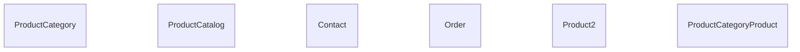
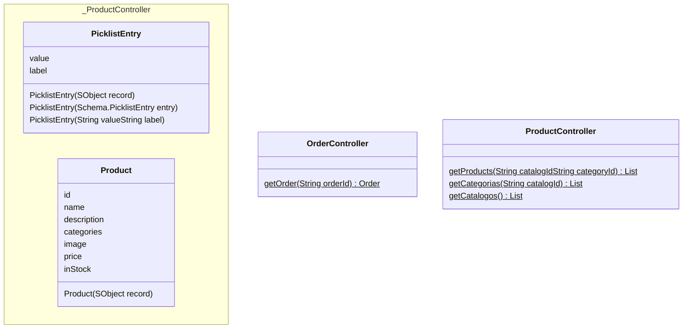

import Readme from '../README.md'

<Readme components={props.components} />
<!-- START autogenerated-objects -->

## Objetos

### Transaccionales

| #   | Label | Api Name | Descripcion |
| --- | ----- | -------- | ----------- |
| 

 | [Categoría](/diccionarios/objects/ProductCategory) | ProductCategory ||
| 

 | [Catálogo](/diccionarios/objects/ProductCatalog) | ProductCatalog ||
| 

 | [Contacto](/diccionarios/objects/Contact) | Contact ||
| 

 | [Pedido](/diccionarios/objects/Order) | Order ||
| 

 | [Producto](/diccionarios/objects/Product2) | Product2 ||
| 

 | [Producto de categoría de producto](/diccionarios/objects/ProductCategoryProduct) | ProductCategoryProduct ||

### Configuracion

| #   | Label | Api Name | Descripcion |
| --- | ----- | -------- | ----------- |

| #                                                              | Referencia    |
| -------------------------------------------------------------- | ------------- |
| 

 | Track History |

<!-- END autogenerated-objects -->
<!-- START autogenerated-classes -->

## Classes

### Diagrama

### Listado

| #   | Name | Api Version | Descripcion |
| --- | ----- | ----------- | ----------- |
| 

 | [OrderController](./diccionarios/classes/OrderController) |59||
| 

 | [PicklistEntry](./diccionarios/classes/PicklistEntry) |||
| 

 | [Product](./diccionarios/classes/Product) |||
| 

 | [ProductController](./diccionarios/classes/ProductController) |59||

| #  | Referencia       | #  | Referencia |
| -- | ---------------- | -- | ---------- |
| +  | public or global | #  | protected  |
| -  | private          | ~  | Package    |
| $  | final or static  | *  | abstract   |

<!-- END autogenerated-classes -->