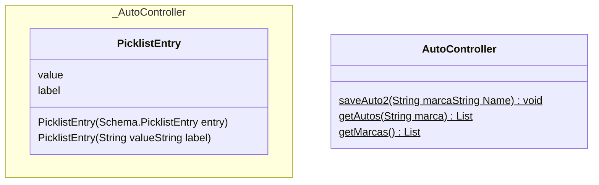

## Introducción

<!-- START autogenerated-classes -->

## Classes

### Diagrama

### Listado

| #   | Name | Api Version | Descripcion |
| --- | ----- | ----------- | ----------- |
| 

 | [AutoController]([AutoController](/diccionarios/classes/AutoController)) |59||
| 

 | [PicklistEntry]([PicklistEntry](/diccionarios/classes/PicklistEntry)) |||

| #  | Referencia       | #  | Referencia |
| -- | ---------------- | -- | ---------- |
| +  | public or global | #  | protected  |
| -  | private          | ~  | Package    |
| $  | final or static  | *  | abstract   |

<!-- END autogenerated-classes -->