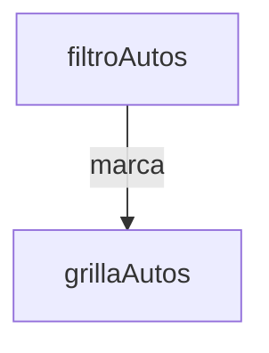

## Diagrama de Componentes

Cuando se selecciona una marca en el componente filtroAutos, se va a disparar un evento con la marca seleccionada.
Por otro lado grillAutos, se va a subscribir al topico para escuchar ese evento y recibir la marca seleccionada

## Referencias
* https://medium.com/@sendtosachin27/component-communication-in-lwc-a3ad91abad89
* https://developer.salesforce.com/docs/component-library/bundle/lightning-message-service/documentation