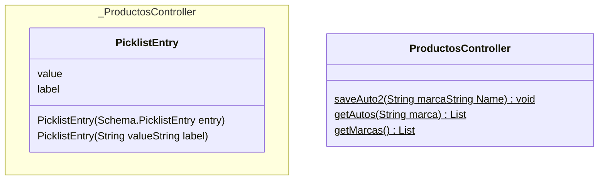

## Introducción

<!-- START autogenerated-classes -->

## Classes

### Diagrama



### Listado

| #   | Name | Api Version | Descripcion |
| --- | ----- | ----------- | ----------- |
| <div class="icons"></div> | [ProductosController](./diccionarios/classes/ProductosController) |59||
| <div class="icons"></div> | [PicklistEntry](./diccionarios/classes/PicklistEntry) |||

| #  | Referencia       | #  | Referencia |
| -- | ---------------- | -- | ---------- |
| +  | public or global | #  | protected  |
| -  | private          | ~  | Package    |
| $  | final or static  | *  | abstract   |

<!-- END autogenerated-classes -->

<!-- START autogenerated-objects -->

## Objetos

```mermaid
erDiagram

```

### Transaccionales

| #   | Label | Api Name | Descripcion |
| --- | ----- | -------- | ----------- |

### Configuracion

| #   | Label | Api Name | Descripcion |
| --- | ----- | -------- | ----------- |

| #                                                              | Referencia    |
| -------------------------------------------------------------- | ------------- |
| <div class="icons"></div> | Track History |

<!-- END autogenerated-objects -->